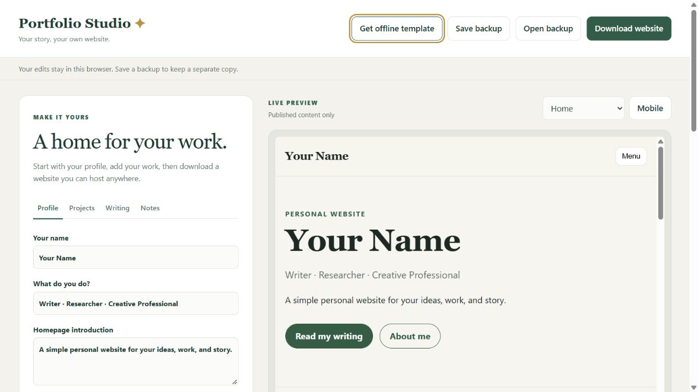

# Portfolio Studio — Universal Personal Website Template

A portable portfolio, personal website and blog for people with no coding experience.

**[Try the live demo](https://portfolio-studio-malik.pages.dev/)**

Built by **Malik Kolade**. This project combines a browser-based editor, live previews, local backups and a static website exporter using vanilla JavaScript. The public editor is hosted on Cloudflare Pages.



## Engineering decisions

- A shared renderer generates both the sandboxed live preview and complete public HTML pages.
- Public exports contain only published entries in visible sections; editable backups keep drafts separately.
- The editor works offline without a database or installed development tools.
- A small Markdown renderer escapes raw HTML and validates link protocols.
- ZIP generation runs entirely in the browser, with CRC32 integrity checks and no external libraries.
- Automated checks cover draft exclusion, hidden sections, content safety, validation, uploaded image assets and ZIP structure.

**Start by opening `editor/index.html`.** On Windows, double-click `OPEN EDITOR.cmd`.

Portfolio Studio runs in your browser. Edit your profile, upload a photo, choose a theme, add projects, write articles and preview the results. Download a complete website ZIP and upload it to a static hosting provider of your choice.

No installation, Python, GitHub, Netlify or OAuth setup is needed for the portable editor. Hosting a public website still requires a hosting account.

## Quick start

1. Extract the template ZIP and open `editor/index.html`.
2. Replace the sample profile and entries with your own.
3. Choose which sections to show and which entries to include.
4. Click **Save backup** to keep an editable copy, including drafts.
5. Click **Download website** to get your public website ZIP.
6. Upload that website ZIP to a static host. For example, Cloudflare Pages supports dashboard Direct Upload.

Read the [Beginner Setup Guide](docs/BEGINNER_SETUP.md) or the [complete editor guide](docs/PORTABLE_EDITOR.md).

## What you get

- Profile, projects, articles, notes and contact pages
- Five colour themes and controls to hide unused sections
- PNG, JPEG and WebP profile photo upload
- Live page preview and mobile preview
- Browser autosave, backup downloads and backup imports
- Complete HTML export with page-specific titles and descriptions
- Individual article pages with readable addresses
- A downloadable ZIP with no external script dependencies
- Drafts and hidden sections excluded from public exports
- Keyboard focus styles, skip links and accessible mobile menus
- An optional GitHub-backed Decap CMS workflow for advanced users

## How editing works

Open editor → fill in forms → preview → save backup → download website → upload to hosting.

Browser autosave is a convenience. Save a backup after editing: browser storage may be cleared or unavailable. Backups contain drafts and should stay private. Website downloads contain only the published content in visible sections.

Your exported website works without JavaScript for its content. A small script controls the mobile menu. Extract the website ZIP and open its `index.html` to preview it offline.

The editor never uploads your work or connects to your hosting account. Changes become public only when you upload a new website export. An image supplied by URL is still loaded from its external host.

## For existing CMS users

The original Decap CMS in `admin/` remains available as an advanced option. It requires GitHub authentication configuration and is separate from the portable editor.

The included Netlify configuration now builds static pages with `node tools/build-site.cjs --cms` and publishes `dist/`, rather than serving source JSON. Drafts are excluded from that public build. The CMS edits the repository JSON files as before.

See [advanced Netlify setup](docs/NETLIFY_SETUP.md) and [CMS editing](docs/CMS_GUIDE.md). Do not upload the entire source folder as your public website.

## Maintainer commands

Node.js is needed only for these maintainer commands, not for the portable browser editor.

```text
node tools/prepare-editor.cjs
node --test tests/builder.test.cjs
node tools/build-site.cjs
node tools/package-template.cjs
```

`prepare-editor.cjs` refreshes the editor's bundled sample content and styles after changes to the source JSON or CSS. It does not alter an owner's saved editor data. `build-site.cjs` creates `dist/` and `sample-website.zip` from repository content; it replaces the generated `dist/` directory on each build.

`package-template.cjs` creates `portfolio-template.zip` for distribution. It excludes generated exports, the preview screenshot and local tool metadata. It packages generic samples, not browser-local edits or downloaded backups.

## Structure

- `editor/` — offline Portfolio Studio, bundled sample content and editor styling
- `assets/js/site-builder.js` — validation, safe Markdown, static rendering and ZIP generation
- `assets/css/style.css` — shared public website design
- `content/` — sample JSON and optional CMS source content
- `admin/` — optional Decap CMS
- `tools/` — maintainer helpers and optional static build
- `tests/` — export, privacy, validation and ZIP checks
- `docs/` — beginner and advanced documentation

The root HTML pages remain a legacy developer preview and need a web server to load JSON. The portable editor and exported websites work directly from disk.

## License

MIT. Created and maintained by Malik Kolade. Version 1.1.0.
